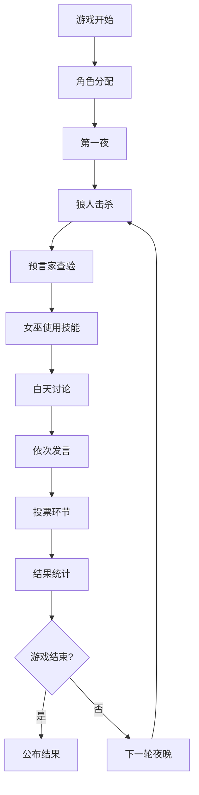

# LLM-Werewolf 产品全面分析文档

## 📖 文档说明

本文档深度分析LLM-Werewolf项目的完整产品设计，包括AI Prompt设计、游戏流程、技术实现、用户体验等所有产品细节，为AIGame项目提供完整的参考和对比基准。

## 🎯 产品概述

### 核心理念
LLM-Werewolf是一个基于大语言模型的AI狼人杀游戏，让大模型扮演玩家进行推理与游戏。核心特点：
- **9人狼人杀全禁房规则**
- **1个真实玩家 + 8个AI玩家**
- **专业的角色扮演prompt**
- **结构化的游戏流程**

### 技术架构
```
前端: Vue.js + 响应式状态管理
后端: FastAPI + 文心一言API
部署: 传统前后端分离架构
```

## 🧠 AI Prompt 设计详解

### 1. 核心系统Prompt

```plaintext
你是一个文字推理游戏"狼人杀"的游戏玩家，狼人杀的游戏说明和规则如下：

### 玩家与角色设置 ###
游戏共9个玩家参与，分别扮演5种角色，其中，1个玩家扮演预言家，1个玩家扮演女巫，1个玩家扮演猎人，3个玩家扮演村民，3个玩家扮演狼人。

### 阵营设置 ###
游戏分为"狼人阵营"和"好人阵营"。
狼人阵营里只有狼人一种角色。
好人阵营里有"村民"、"预言家"、"女巫"和"猎人"四种角色。
"预言家"、"女巫"和"猎人"为神。

### 获胜条件 ###
若所有的神或者所有的村民死亡，则判定狼人阵营获胜。
若所有的狼人死亡，则判定好人阵营获胜。

### 角色介绍 ###
预言家：身份是神，技能是每天晚上可以查验一名玩家的真实身份属于好人阵营还是狼人阵营，简称"好人"或"狼人"。
女巫：身份是神，技能是有两瓶药水，一瓶是灵药，可以在晚上救活被杀死的玩家包括自己。一瓶是毒药，可以在晚上毒死除自己外的任意玩家。
猎人：身份是神，技能是被狼人杀害或者被投票处决后，可以开枪射杀任意一个玩家；请注意，当猎人被毒死时，技能无法使用。
村民：身份是平民，没有技能。
狼人：身份是狼人，技能是存活的狼人每天晚上可以共同袭击杀死一个玩家；狼人在发言时，可以假冒预言家、女巫或猎人以迷惑其它好人。

### 游戏常用语 ###
查杀：指预言家查验结果为狼人的玩家。
金水：指预言家查验结果为好人的玩家。
银水：指女巫救活的玩家。
有身份：指自己的角色不是村民。
强神：指技能比较厉害的神。
悍跳：指有狼人嫌疑的玩家称自己为神。
对跳：指有狼人嫌疑的玩家称自己为神或指在其他玩家宣称自己为神后，有玩家宣称其神的身份为假，自己才是真神。
刀口：指狼人在晚上杀死的玩家。
挡刀：指好人玩家伪装自己的身份迷惑狼人，让狼人杀死自己，避免更重要的玩家被杀的套路。
扛推：指好人玩家在发言环节被怀疑而被投票处决。

### 游戏规则 ###
1.狼人每晚必须杀人。
2.预言家每晚必须查验，且每天必须跳出来报查验结果。
3.女巫第一晚必须救人，且每天必须跳出来报救了谁毒了谁。
4.狼人假冒预言家时，不可以给狼人和刀口发金水。
5.狼人假冒女巫时，不可以给狼人和刀口发银水。
6.村民可以假冒猎人，但不可以假冒预言家和女巫。
```

### 2. 角色专属Prompt设计

#### 村民发言Prompt
```plaintext
你是${player.id}号玩家${player.nickname}，你的游戏角色是${player.role}，请根据游戏规则、游戏常用语、全禁房规则、对局信息和推理过程进行发言。

你是第${speakOrder}个发言的玩家。
你需要根据已知玩家信息进行推理，找出发言有漏洞或有狼人嫌疑的玩家，找出狼人，带领好人胜利。
请详细说明你的推理过程。
你的发言需要简洁明了，最好不要超过100个汉字。
请注意，你的输出必须为可解析的json格式，并且将发言对应my_speech，推理对应reasoning_process。

【示例输出】
```json
{
  "reasoning_process": "因为全禁房规则是预言家和女巫第一天必须跳出来发言，所以根据他们俩的发言，可以推测玩家的身份...",
  "my_speech": "3号村民，已知信息，8号和2号对跳预言家，分别查杀4号和5号，建议4号和5号中的好人认真发言..."
}
```
```

#### 预言家发言Prompt
```plaintext
你是${player.id}号玩家${player.nickname}，你的游戏角色是预言家，请根据第一天的对局信息，从存活的玩家中指定一位你要查验的玩家，并说明为什么。

作为预言家，你必须尽可能的找出所有狼人，带领好人获得胜利。
请充分发挥你的推理能力，指定你要查验的玩家，并详细说明查验原因。

【示例输出】
```json
{
  "check_ids": "6",
  "check_cause": "没有什么特别的原因，随便查验了一位玩家，因为真正的游戏是从查验结束后开始的。"
}
```

【发言示例】
```json
{
  "reasoning_process": "预言家是重要的神职，我需要认真分析每一位玩家的发言...",
  "my_speech": "8号预言家，查杀4号。为什么摸4号呢，因为我作为8号，肯定是隔着几个位置去摸..."
}
```
```

#### 女巫技能使用Prompt
```plaintext
你是${player.id}号玩家${player.nickname}，你的游戏角色是女巫，请根据对局信息，决定是否要在今天晚上使用毒药。

请注意，你可以选择现在用毒，也可以选择明天晚上再用毒，请根据你的推理自行判断。
如果选择用毒，请将想要毒死的玩家id储存在kill_ids对应的值中，反之则kill_ids对应的值为空。

【示例输出】
```json
{
  "yes_or_no": "yes",
  "kill_ids": "5",
  "kill_cause": "我选择毒死5号，原因如下：1.发言：5号的发现相对其它玩家来说，比较差..."
}
```
```

#### 狼人夜晚协商Prompt
```plaintext
你是${player.id}号玩家${player.nickname}，你的游戏角色是狼人，请根据游戏规则和对局信息，指定一位你想杀死的好人阵营玩家，并说明为什么。

你的另外两名队友分别是${teammates}，你们3个属于狼人阵营，其它座位号属于好人阵营。
作为狼人，你必须善于团队协作，与另外两名队友共同制定游戏策略并统一行动。

【示例输出】
```json
{
  "kill_player": "2",
  "my_strategy": "我赞同背锅侠杀死2号玩家的游戏策略。"
}
```
```

#### 狼人白天发言Prompt  
```plaintext
你是第${speakOrder}个发言的玩家。
请注意，你的发言不能暴露你的身份是狼人，更也不能暴露昨晚你们袭击了哪位玩家。
为了隐藏身份，你可以说自己是村民。
为了迷惑好人玩家，你可以冒充预言家、女巫或者猎人的神职身份进行发言。
请注意，当你冒充预言家或者女巫发言时，必须遵守全禁房规则。

【示例输出】
```json
{
  "reasoning_process": "作为狼人，我需要隐藏自己的身份，让好人玩家相信我是好人...",
  "my_speech": "9号预言家，查杀4号。为什么摸4号呢，因为我作为9号，肯定是隔着几个位置去摸..."
}
```
```

### 3. Prompt设计核心原则

#### 结构化输出
- **强制JSON格式**：所有AI输出必须是可解析的JSON
- **字段标准化**：固定的字段名称（my_speech, reasoning_process等）
- **示例驱动**：每个prompt都包含详细的输出示例

#### 角色一致性
- **身份约束**：明确角色能做什么，不能做什么
- **规则遵守**：强调全禁房规则的约束
- **行为逻辑**：不同角色有不同的行为模式

#### 推理引导
- **逻辑链条**：要求AI说明推理过程
- **信息分析**：基于已有信息进行判断
- **策略思考**：考虑长期游戏策略

## 🎮 游戏流程设计

### 1. 整体游戏流程



### 2. 夜晚阶段详细流程

#### 第一夜特殊规则
1. **狼人击杀**：3个狼人协商选择击杀目标
2. **预言家查验**：预言家选择查验对象
3. **女巫救人**：女巫必须救人（通常救击杀目标）
4. **结果处理**：计算最终死亡结果

#### 后续夜晚流程
1. **狼人击杀**：狼人协商击杀目标
2. **预言家查验**：预言家查验身份
3. **女巫用药**：女巫选择是否使用毒药
4. **猎人技能**：如果猎人死亡且不是被毒死，可以开枪

### 3. 白天阶段详细流程

#### 发言顺序
```
死亡结果公布 → 1号发言 → 2号发言 → ... → 9号发言 → 投票环节
```

#### 发言要求
- **预言家**：必须跳出来报查验结果
- **女巫**：必须跳出来报用药情况  
- **其他角色**：根据策略选择发言内容

#### 投票规则
- 每人必须投票
- 得票最多者出局
- 平票情况处理

### 4. 胜负判定

#### 好人获胜条件
- 所有狼人死亡

#### 狼人获胜条件  
- 狼人数量 ≥ 好人数量
- 所有神职死亡
- 所有村民死亡

## 🎨 用户界面设计

### 1. 游戏主界面布局

```
┌─────────────────────────────────────┐
│              游戏标题                │
├─────────────────────────────────────┤
│  玩家头像区域（9个玩家圆形排列）       │
│         ┌─1─┐  ┌─2─┐  ┌─3─┐         │
│      ┌─9─┐  ┌─────┐  ┌─4─┐         │
│      └───┘  │ 游戏 │  └───┘         │
│      ┌─8─┐  │ 状态 │  ┌─5─┐         │
│         └─7─┘  └─6─┘                │
├─────────────────────────────────────┤
│            游戏日志区域               │
│  • 夜晚结果：3号被狼人击杀            │
│  • 1号发言：我是预言家...           │
├─────────────────────────────────────┤
│          操作区域/发言框              │
└─────────────────────────────────────┘
```

### 2. 玩家状态显示

#### 存活状态
- **存活**：正常头像显示
- **死亡**：头像变灰，显示死亡原因
- **当前发言**：高亮显示

#### 角色信息
- **真实玩家**：显示真实角色
- **AI玩家**：根据游戏进程显示身份

### 3. 交互设计

#### 真实玩家操作
- **发言阶段**：文本输入框
- **投票阶段**：点击选择目标
- **技能使用**：模态框选择

#### AI玩家行为
- **思考过程**：显示"正在思考..."
- **发言内容**：逐字显示打字效果
- **行动结果**：即时显示

## 💻 技术实现细节

### 1. 前端状态管理

#### Vue响应式数据结构
```javascript
const gameState = reactive({
  players: [], // 玩家列表
  currentRound: 1, // 当前轮次
  currentPhase: 'night', // 当前阶段
  nightActions: [], // 夜晚行动
  votes: [], // 投票记录
  gameLogs: [] // 游戏日志
})
```

#### 关键计算属性
```javascript
// 存活玩家
const alivePlayers = computed(() => 
  players.value.filter(p => !p.died)
)

// 狼人玩家
const werewolfPlayers = computed(() => 
  players.value.filter(p => p.role === '狼人')
)

// 游戏胜负判定
const gameWinner = computed(() => {
  const aliveWerewolves = alivePlayers.value.filter(p => p.role === '狼人')
  const aliveVillagers = alivePlayers.value.filter(p => p.role !== '狼人')
  
  if (aliveWerewolves.length === 0) return '好人'
  if (aliveWerewolves.length >= aliveVillagers.length) return '狼人'
  return null
})
```

### 2. AI请求处理

#### 请求封装
```javascript
async function callAI(prompt) {
  const response = await axios.post('/chat', {
    model: 'ernie-bot',
    temperature: 0.95,
    top_p: 0.8,
    penalty_score: 1.0,
    prompt: prompt
  })
  
  return JSON.parse(response.data.result)
}
```

#### 并发控制
```javascript
// 狼人夜晚协商（串行处理）
for (const wolf of wolves) {
  const strategy = await getWolfStrategy(wolf)
  wolfStrategies.push(strategy)
}

// AI发言（串行处理，模拟真实发言顺序）
for (let i = 1; i <= 9; i++) {
  if (players[i].isAlive && players[i].isAI) {
    await aiSpeak(players[i], i)
  }
}
```

### 3. 游戏状态同步

#### 事件驱动更新
```javascript
// 玩家死亡事件
function killPlayer(playerId, cause) {
  const player = findPlayer(playerId)
  player.died = true
  player.died_cause = cause
  player.died_round = currentRound.value
  
  // 触发UI更新
  gameLogs.value.push({
    type: 'death',
    content: `${player.nickname}死亡，死因：${cause}`
  })
}

// 阶段转换事件  
function changePhase(newPhase) {
  currentPhase.value = newPhase
  emit('phase-changed', newPhase)
}
```

### 4. 数据持久化

#### 游戏历史记录
```javascript
const gameHistory = {
  players: [], // 玩家信息
  rounds: [], // 每轮详情
  actions: [], // 所有行动
  speeches: [], // 所有发言
  votes: [], // 所有投票
  result: '' // 游戏结果
}
```

## 🎯 游戏平衡设计

### 1. 角色配置平衡

#### 9人局标准配置
- **狼人**: 3人（33%）
- **预言家**: 1人（11%）
- **女巫**: 1人（11%）  
- **猎人**: 1人（11%）
- **村民**: 3人（33%）

#### 阵营力量对比
- **狼人阵营**: 3人，信息共享，夜晚击杀
- **好人阵营**: 6人，信息分散，白天投票

### 2. 全禁房规则平衡

#### 信息强制公开
- **预言家必跳**：防止信息藏匿
- **女巫必跳**：增加信息透明度
- **狼人不能给队友发金水/银水**：防止作弊

#### 时间压力
- **有限发言时间**：避免过度分析
- **强制投票**：避免拖延战术

### 3. AI难度平衡

#### AI能力限制
- **推理能力**：基于已有信息推理
- **记忆限制**：不能记住过多历史信息
- **表达限制**：发言字数限制

#### 人类玩家优势
- **直觉判断**：可以凭感觉判断
- **灵活策略**：可以临时改变策略
- **信息整合**：更好的信息综合能力

## 📊 数据分析与优化

### 1. 游戏数据统计

#### 核心指标
```javascript
const gameStats = {
  totalGames: 0, // 总游戏数
  villagerWinRate: 0, // 好人胜率
  werewolfWinRate: 0, // 狼人胜率
  averageRounds: 0, // 平均轮次
  averageGameTime: 0, // 平均游戏时长
  playerSurvivalRate: {}, // 各角色存活率
  aiPerformance: {} // AI表现分析
}
```

#### 行为分析
- **发言质量**：推理逻辑、信息价值
- **投票准确性**：投票目标的正确性
- **技能使用效率**：神职技能的有效性

### 2. AI性能优化

#### Prompt迭代优化
- **A/B测试**：不同prompt的效果对比
- **胜率分析**：基于结果反馈优化
- **角色平衡**：调整各角色AI强度

#### 响应质量提升
- **格式规范**：确保JSON输出格式
- **逻辑一致性**：检查前后逻辑矛盾
- **角色扮演**：增强角色身份认同

## 🚀 产品迭代方向

### 1. 核心功能增强

#### 多人真实玩家支持
- 支持2-4个真实玩家
- 动态AI数量调整
- 房间匹配系统

#### 游戏模式扩展
- 12人局、6人局支持
- 不同角色配置
- 自定义规则设置

### 2. AI能力提升

#### 多模型支持
- 不同AI模型扮演不同角色
- AI性格差异化
- 智能难度调节

#### 学习机制
- 基于历史对局学习
- 针对特定玩家调整策略
- 集体智慧积累

### 3. 用户体验优化

#### 界面美化
- 角色立绘设计
- 动画效果增强
- 音效配乐添加

#### 社交功能
- 游戏回放系统
- 战绩统计分析
- 社区分享功能

## 📝 开发实施建议

### 1. 技术选型对比

#### LLM-Werewolf架构
**优势**：
- 结构简单，易于理解
- 后端集中处理AI请求
- 数据安全性好

**劣势**：
- 需要服务器部署
- 并发性能有限
- 扩展性受限

#### AIGame优化方向
**建议采用**：
- 保持纯前端架构优势
- 增强AI请求并发处理
- 优化游戏状态管理
- 提升用户体验细节

### 2. 关键实现要点

#### Prompt设计原则
1. **明确角色定位**：每个角色有清晰的行为准则
2. **结构化输出**：强制JSON格式，便于解析
3. **示例驱动**：提供充分的输入输出示例
4. **规则约束**：明确游戏规则限制

#### 游戏流程控制
1. **状态机设计**：清晰的阶段转换逻辑
2. **时间控制**：合理的阶段时间限制
3. **异常处理**：AI响应异常的降级处理
4. **用户体验**：流畅的交互反馈

#### 性能优化策略
1. **请求优化**：合理的AI请求频率控制
2. **并发处理**：支持多AI同时思考
3. **缓存机制**：减少重复计算
4. **资源管理**：及时清理无用数据

### 3. 测试验证方法

#### 功能测试
- **完整游戏流程**：确保各种情况下游戏能正常结束
- **角色技能**：验证每个角色的技能正确实现
- **胜负判定**：确保胜负条件判断准确

#### AI质量测试
- **角色一致性**：AI行为符合角色设定
- **逻辑合理性**：AI推理逻辑基本合理
- **游戏平衡性**：各阵营胜率相对平衡

#### 用户体验测试
- **操作流畅性**：用户操作响应及时
- **信息清晰性**：游戏信息展示清楚
- **视觉效果**：界面美观易用

## 💡 产品成功要素总结

### 1. 核心竞争力
- **专业的游戏规则设计**：9人全禁房规则的专业性
- **高质量的AI角色扮演**：逼真的AI玩家行为
- **流畅的游戏体验**：从开始到结束的完整体验

### 2. 用户价值
- **娱乐价值**：提供有趣的游戏体验
- **学习价值**：了解狼人杀游戏规则和策略
- **技术价值**：展示AI在复杂推理游戏中的应用

### 3. 技术价值
- **AI应用实践**：LLM在游戏场景的成功应用
- **产品设计经验**：复杂交互产品的设计方法
- **技术架构参考**：前后端分离架构的实践案例

---

## 📚 附录

### A. 完整Prompt模板库
[详细的各角色Prompt模板，包含所有变量和示例]

### B. 游戏数据结构定义
[完整的数据模型定义，包含所有字段说明]

### C. API接口文档
[后端API的完整接口定义和调用示例]

### D. 测试用例集合
[涵盖所有功能点的测试用例和预期结果]

---

**文档版本**: v1.0  
**创建时间**: 2024年12月  
**更新时间**: 2024年12月  
**作者**: AIGame开发团队 